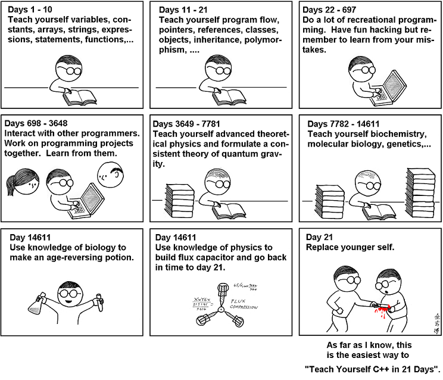

Only got 21 days to teach yourself ${technology name}? I got ya

<!--truncate-->

[Comic link](https://abstrusegoose.com/249)

Joking aside, I used to give myself unrealistic deadlines for learning stuff. Needless to say, that didn't work out really well. Here is a list (if I can find more) of resources related to why you should take your time:

- [Teach Yourself Programming in Ten Years - Peter Norvig](http://norvig.com/21-days.html)
